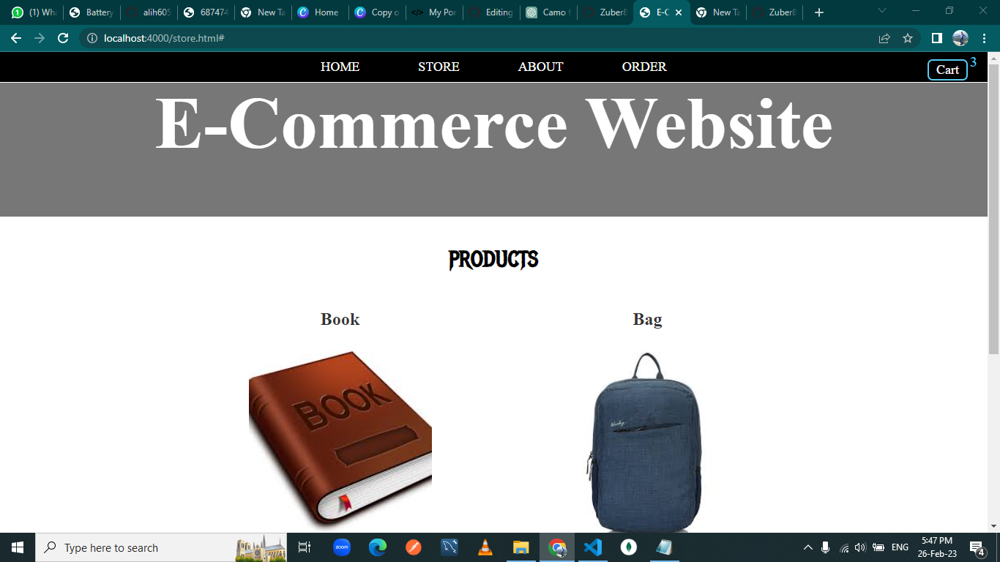
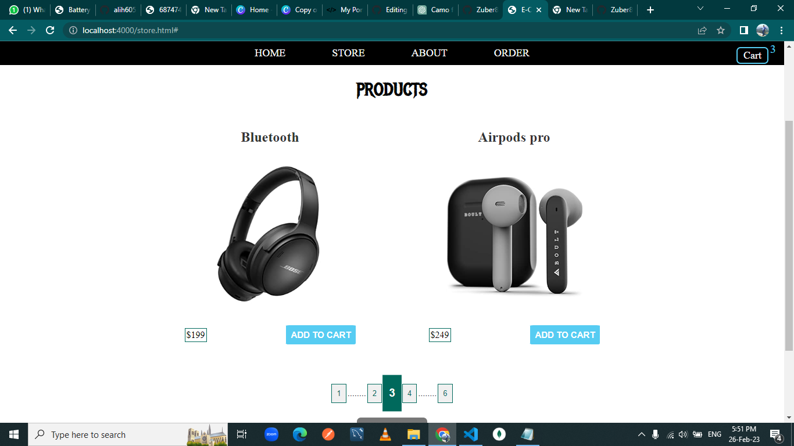
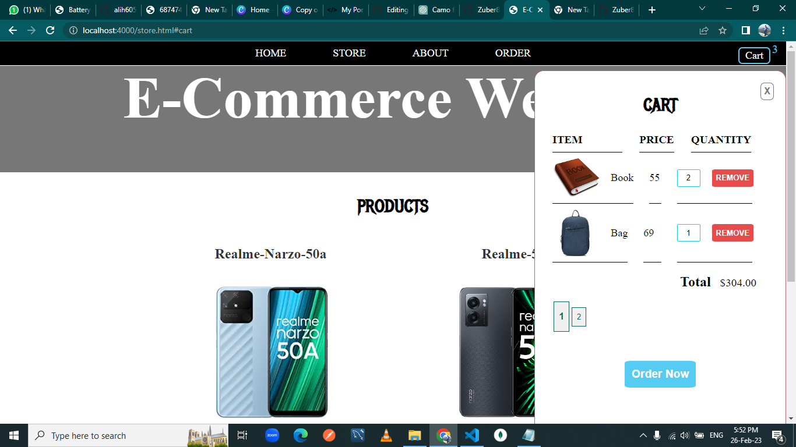
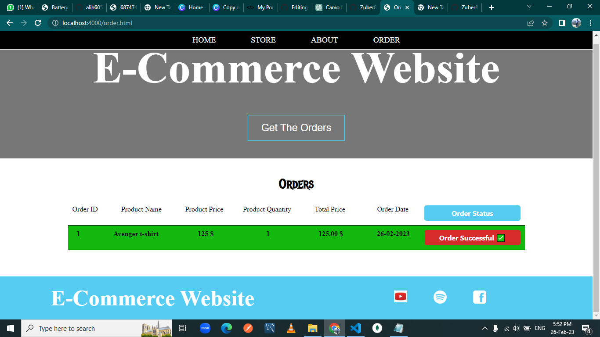

<h1 align="center">Wellcome to my Ecommerce-Website project</h1>

- 🌱 Frontend : **HTML, CSS, Java Script**
- 🌱 Backend :  **Express JS, Node JS, MySQL**
- 🌱 Deployment : **Amazon Web Service**
- 🌱 Implimented one-to-many and many-to-many relationship using Sequelize.
- 🌱 Implemented Pegination feature to show a limited number of products per page.
- 🌱 Implimented cart feature, where user can add proucts to the cart and delete from the cart.
- 🌱 Once all the desired products have been added in the cart, they can proceed to place their order.
- 🌱 Implimented Order page, where user can check there order.

